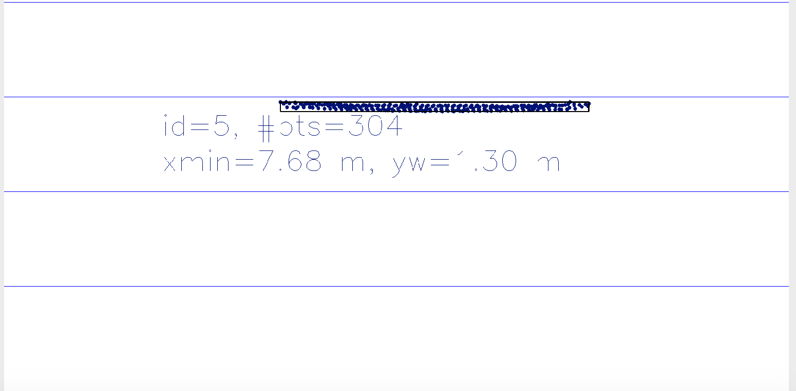
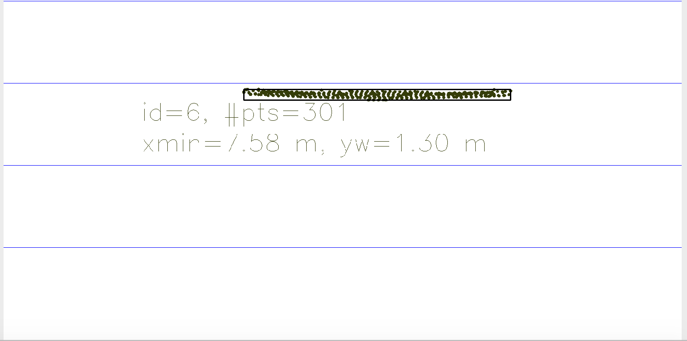
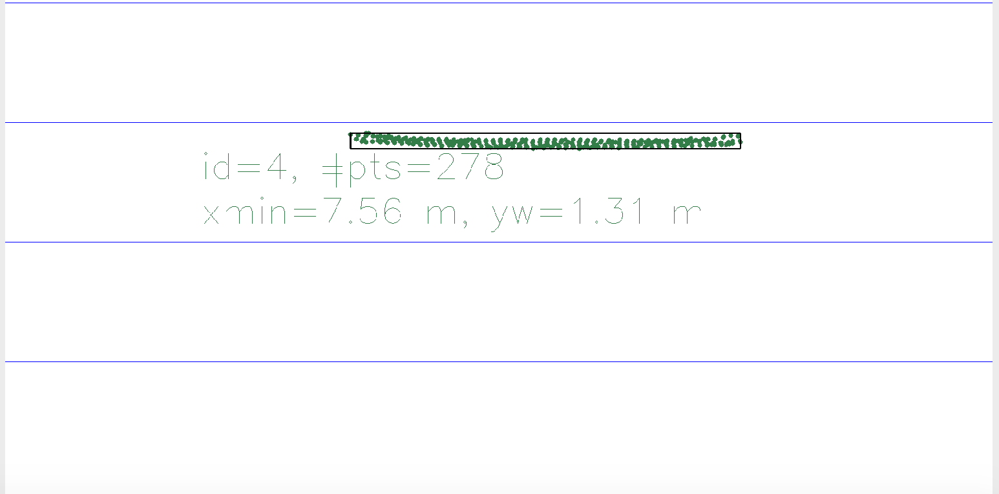
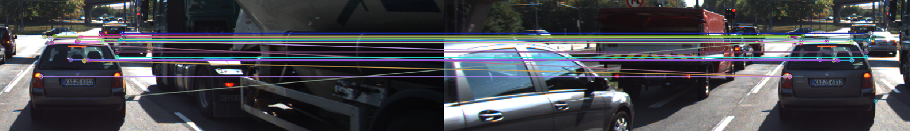

# SFND 3D Object Tracking

Welcome to the final project of the camera course. By completing all the lessons, you now have a solid understanding of keypoint detectors, descriptors, and methods to match them between successive images. Also, you know how to detect objects in an image using the YOLO deep-learning framework. And finally, you know how to associate regions in a camera image with Lidar points in 3D space. Let's take a look at our program schematic to see what we already have accomplished and what's still missing.


In this final project, you will implement the missing parts in the schematic. To do this, you will complete four major tasks: 
1. First, you will develop a way to match 3D objects over time by using keypoint correspondences. 
2. Second, you will compute the TTC based on Lidar measurements. 
3. You will then proceed to do the same using the camera, which requires to first associate keypoint matches to regions of interest and then to compute the TTC based on those matches. 
4. And lastly, you will conduct various tests with the framework. Your goal is to identify the most suitable detector/descriptor combination for TTC estimation and also to search for problems that can lead to faulty measurements by the camera or Lidar sensor. In the last course of this Nanodegree, you will learn about the Kalman filter, which is a great way to combine the two independent TTC measurements into an improved version which is much more reliable than a single sensor alone can be. But before we think about such things, let us focus on your final project in the camera course. 

## Dependencies for Running Locally
* cmake >= 2.8
  * All OSes: [click here for installation instructions](https://cmake.org/install/)
* make >= 4.1 (Linux, Mac), 3.81 (Windows)
  * Linux: make is installed by default on most Linux distros
  * Mac: [install Xcode command line tools to get make](https://developer.apple.com/xcode/features/)
  * Windows: [Click here for installation instructions](http://gnuwin32.sourceforge.net/packages/make.htm)
* Git LFS
  * Weight files are handled using [LFS](https://git-lfs.github.com/)
* OpenCV >= 4.1
  * This must be compiled from source using the `-D OPENCV_ENABLE_NONFREE=ON` cmake flag for testing the SIFT and SURF detectors.
  * The OpenCV 4.1.0 source code can be found [here](https://github.com/opencv/opencv/tree/4.1.0)
* gcc/g++ >= 5.4
  * Linux: gcc / g++ is installed by default on most Linux distros
  * Mac: same deal as make - [install Xcode command line tools](https://developer.apple.com/xcode/features/)
  * Windows: recommend using [MinGW](http://www.mingw.org/)

## Basic Build Instructions

1. Clone this repo.
2. Make a build directory in the top level project directory: `mkdir build && cd build`
3. Compile: `cmake .. && make`
4. Run it: `./3D_object_tracking`.

## Lidar outliers removal

The estrategy followed to remove outliers was based in statistical methods. The mean of the lidar cloud is calculated and then, any poitn farthest to one standard deviation will be removed.
I used the pcl library as follows:

```cpp
for (vector<BoundingBox>::iterator it2 = boundingBoxes.begin(); it2 != boundingBoxes.end(); ++it2)
    {
        if (it2->lidarPoints.size() != 0)
        {
            cout << "Before filter : " << it2->lidarPoints.size() << endl;
            pcl::PointCloud<pcl::PointXYZ>::Ptr cloud (new pcl::PointCloud<pcl::PointXYZ>);
            for (auto it3 = it2->lidarPoints.begin(); it3 != it2->lidarPoints.end(); ++it3)
            {
                pcl::PointXYZ point;
                point.x = it3->x;
                point.y = it3->y;
                point.z = it3->z;
    
                cloud->push_back(point);

            }
            pcl::PointCloud<pcl::PointXYZ>::Ptr cloud_filtered (new pcl::PointCloud<pcl::PointXYZ>);
            pcl::StatisticalOutlierRemoval<pcl::PointXYZ> sor;
            sor.setInputCloud (cloud);
            sor.setMeanK (50);
            sor.setStddevMulThresh (1.0);
            sor.filter (*cloud_filtered);
            
            it2->lidarPoints.clear();
            for(auto it3 = cloud_filtered->begin(); it3 != cloud_filtered->end(); ++it3)
            {
                LidarPoint filtered_point;
                filtered_point.x = it3->x;
                filtered_point.y = it3->y;
                filtered_point.z = it3->z;
                it2->lidarPoints.push_back(filtered_point);
            }
        cout << "After filter : " << it2->lidarPoints.size() << endl;
        }
        
    }
```

## Matched Keypoints outliers removal

The strategy for removing outliers from the matched keypoints is as follows:
* Calculate the mean of distances of keypoints in the current frame to the matched keypoints in the previous frame at each bounding box.
* Remove the keypoints that are farthest than the mean mulptiplied by a ratio.

This is the code:
```cpp
void clusterKptMatchesWithROI(BoundingBox &boundingBox, std::vector<cv::KeyPoint> &kptsPrev, std::vector<cv::KeyPoint> &kptsCurr, std::vector<cv::DMatch> &kptMatches)
{
    for(auto it = kptMatches.begin(); it != kptMatches.end(); ++it) 
    {
        auto &currentPoint = kptsCurr[it->trainIdx].pt;
        if (boundingBox.roi.contains(currentPoint)) {
            boundingBox.kptMatches.push_back(*it);
        }
    }

    double mean = 0;

    for (auto it : boundingBox.kptMatches) {
        cv::KeyPoint currentPoint = kptsCurr.at(it->trainIdx);
        cv::KeyPoint prevPoint = kptsPrev.at(it->queryIdx);
        double dist = cv::norm(currentPoint.pt - prevPoint.pt);
        mean += dist;
    }

    mean = mean / boundingBox.kptMatches.size();

    double ratio = 1.4;

    for (auto it = boundingBox.kptMatches.begin(); it < boundingBox.kptMatches.end();) {
        cv::KeyPoint currentPoint = kptsCurr.at(it->trainIdx);
        cv::KeyPoint prevPoint = kptsPrev.at(it->queryIdx);
        double dist = cv::norm(currentPoint.pt - prevPoint.pt);

        if (dist >= mean * ratio) {
            boundingBox.kptMatches.erase(it);
        }
        else {
            it++;
        }
    }
    
}

```


## FP.5 : Performance Evaluation 1

One of the problems that identified is when you have outliers in the lidar cloud. It lead to miscalculations on the time to collision. For example, when calculating the pose difference between the closest point to the vehicle in two different frames and one of them have outliers in between the real closest point and the car, it can lead understimate the time to collision. And in the next pair of frames in the buffer, it leads to an overestimation. It can be seen in figure 1, 2 and 3, where TTC is first understimated in frames 5-6 and then overstimated in frame 6-7 due to the presence of outliers in frame 6.


|Detector|Descriptor|Frame|TTC-Lidar|TTC-Camera|
|-|-|-|-|-|
|BRISK|BRISK|5|12.59|32.02|
|BRISK|BRISK|6|7.66|16.87|
|BRISK|BRISK|7|29.06|15.93|


Figure 1.



Figure 2.



Figure 3.

Secondly, I also found problems to match lidar points to objects  Due to the overlaping of bounding boxes it is difficult to match raw lidar points to bounding boxes. One good strategy to deal with this is to cluster lidar clouds prior to bounding box matching.

## FP.6 : Performance Evaluation 2

The csv files with the comparison of the TTC calculations can be found in build/ folder. The best results were gotten with the
AKAZE-BRIEF combination. However, the SIFT keypoint detector and descriptor are present more times in the top ten combinations. 

|Detector|Descriptor|Mean difference among TTC-Camera and TTC-Lidar in seconds|
|-|-|-|
|AKAZE|BRIEF|1.347|
|Shi-Thomasi|SIFT|1.39|
|SIFT|BRIEF|1.393|
|SIFT|BRISK|1.418|
|SIFT|SIFT|1.625|
|AKAZE|BRISK|1.625|
|FAST|SIFT|1.643|
|Shi-Thomasi|BRIEF|1.649|
|SIFT|FREAK|1.656|
|AKAZE|AKAZE|1.661|
|AKAZE|SIFT|1.677|
|Shi-Thomasi|ORB|1.75|
|BRISK|FREAK|1.819|
|FAST|BRIEF|1.84|
|AKAZE|FREAK|1.853|


Figure 4.


|Detector|Descriptor|Frame|TTC-Lidar|TTC-Camera|
|-|-|-|-|-|
|HARRIS|BRISK|13|9.22|568.32|

The camera TTC estimation is way off when there are wrong matches of keypoints.

We also have to take into account details in the image are also critical for the calculation. When the objects are occluded, it is difficult to match keypoints. In a similar way, ilumination in the image affects keypoint detection and description.

The TTC can be improve in several ways:
* Adding a kalman filter for fusion camara and lidar TTC calculation.
* Clustering lidar points and the match the cluster with bounding boxes.
